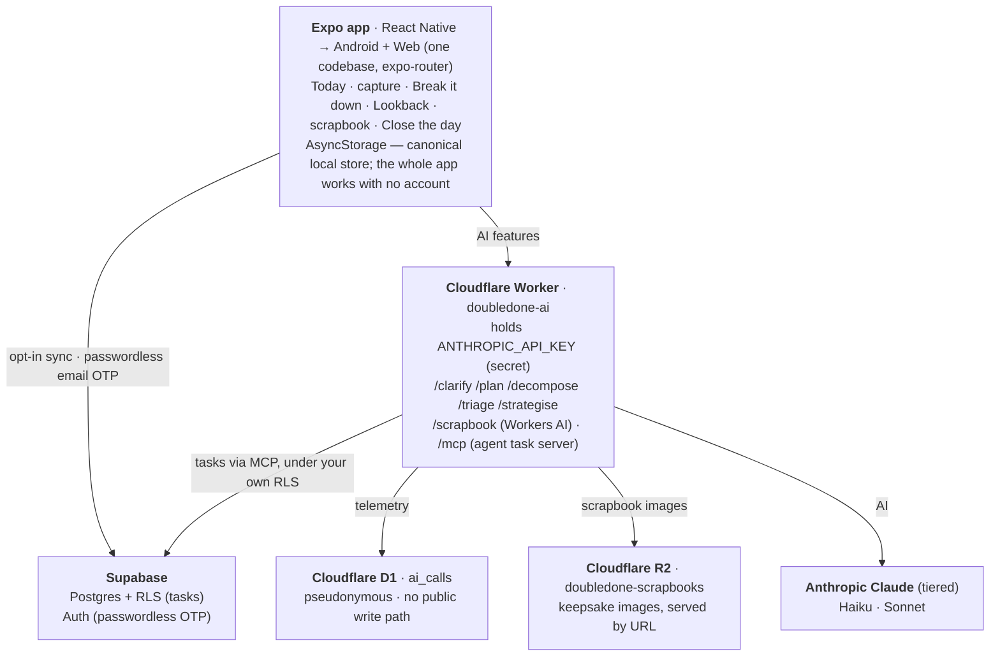

# DoubleDone

[](https://github.com/melroyds/doubledone/actions/workflows/ci.yml)

> A calm, ADHD-friendly daily to-do app. It takes the things you have been avoiding, breaks them into pieces small enough to actually start, shows you only what today needs, and at the end shows you everything you finished, so your brain cannot tell you that you did nothing.

**Status:** core loop live, solo build. The full daily loop, AI triage and phased Break-it-down, recurring tasks, slices, Strategise, the Lookback, close-the-day, reminders, opt-in cloud sync, the AI **scrapbook** (images on Cloudflare **R2**), and a task **MCP server** are shipped on web and Android, alongside the ADHD-specific touches that answer the failure modes below: **shame-free re-entry**, a **focus mode**, **off-list logging**, a **weight-of-today** gauge, **multi-select**, and **data export**. The public-launch basics (privacy policy, account + data deletion, AI-endpoint lockdown) are in too. The whole UI has since had a calm **design pass** (the system redesign), and new users get a guided **first-run** that triages their first brain-dump into a doable day, replayable any time from Settings.
**Live:** [doubledone.app](https://doubledone.app) (web). Android installs via a sideloaded EAS build.

<p align="center">
  
  &nbsp;
  
</p>
<p align="center"><em>Today, the home screen: one doable day. Light, and a dark that follows your device or your choice.</em></p>

<p align="center">
  
  &nbsp;
  
</p>
<p align="center"><em>The Lookback, the payoff: a calendar of everything you actually finished. And the AI scrapbook, a still-life keepsake of the week whose objects evoke what you did, the finished tasks listed beneath.</em></p>

<p align="center">
  
  &nbsp;
  
</p>
<p align="center"><em>Settings, in two calm bands, Comfort (theme, text size, motion) and Access &amp; data. Never an everything-dashboard.</em></p>

<p align="center">
  
</p>
<p align="center"><em>First run: a calm welcome that onboards by doing. Your first brain-dump becomes a doable Today. Replayable any time from Settings.</em></p>

---

## The idea in one line

Today is finite and achievable. The home screen is Today, sized to be doable, and the app's whole job is to keep it that way when life pushes back.

## Why it exists

Most productivity apps are built for neurotypical optimisation: more capture, more structure, streaks, points. For an ADHD, autistic, or chronically-overwhelmed brain those patterns backfire. The real failure modes are different:

- **Task-initiation paralysis** — the dreaded task is too big to start.
- **Time blindness** — "today" quietly fills with more than a day holds.
- **The discounting reflex** — the brain throws away everything you already did and says you did nothing.
- **Rejection-sensitive dysphoria** — a guilt-based, overdue-red, nagging app is not motivating, it is repelling.

DoubleDone is built around those, not around a feature checklist. The founder is in the audience and uses it daily; founder-market fit is the main asset.

## The core loop

1. **Brain-dump** everything on your mind into one friction-free box, one line per thing.
2. **AI triage** ("Sort for me") sorts the dump into today / later / break-it-down, so today stays small.
3. **Break it down** hands a dreaded task to the AI and gets back a startable plan (see below).
4. **Work the day** — a short, doable list. Tap to finish, with a soft sage check, never a shaming strike.
5. **Strategise** when the day is over-full: the AI proposes a calmer spread across coming days, and you accept or decline.
6. **Close the day** gently: what you finished, what rolls forward, zero guilt.
7. **The Lookback** is the payoff: an interactive calendar of everything you actually finished, the old dreaded things included.

## What it does

**Capture & triage**
- Friction-free brain-dump with calm scheduling chips (Today / Tomorrow / Daily / Weekly / Custom).
- AI triage ("Sort for me", Haiku) sorts a multi-line dump into today / later / break-it-down and applies it directly, because capture must be the lowest-pressure surface in the app.
- **First run**: a guided welcome runs your very first brain-dump through that same triage, so the first thing you see is a doable Today, not an empty void or a tutorial wall. Replayable any time from Settings.

**Break it down (the phased planner)**
- Two calm steps: first the AI asks **three qualifying questions** (a due date, gradual-vs-same-day pacing, and one task-specific clarifier), then it returns a plan you **review and accept** (untick any step before adding).
- A real **date picker** that the AI **pre-fills** from a date it spots in your task ("by July 15 2026" → 15 July selected).
- **Phased** for big, long-horizon tasks: the AI returns a roadmap of phases, only **phase one** is broken into steps now, and each later phase becomes a dated milestone in Later, broken down when you reach it. Today stays small while the deadline is honoured.
- Steps are spread across the runway with the dates computed on-device (deterministic, no date maths in the model).

**Working the day**
- **Slices**: track a task in parts (10 TV episodes, a 3-step chore) with a calm progress bar, no gamification.
- **Recurring tasks** (daily / weekly / every-N) with a dedicated Repeating drawer, no streaks.
- **Strategise** (Sonnet): re-spread an over-full day, always propose-then-accept.
- **Long-title marquee**: a title too long to fit scrolls gently instead of truncating, and respects reduced-motion.
- **Tap-and-hold to select**: hold a task to enter selection, then act on one or many at once via an adaptive bar, Done / Tomorrow / Move to… / Break down / Remove, with Select all. One calm gesture replaced both the old per-task long-press menu and a separate multi-select button.

**Built for the failure modes** (each answers one named above)
- **Focus mode** ("Just this one") — pick one task and full-screen it, everything else hidden, for **task-initiation paralysis**.
- **Weight of today** — a calm, honest load gauge so the day cannot silently overfill, for **time blindness**.
- **"I also did that"** — log a win that was never on the list, so the Lookback counts what you actually did, for **the discounting reflex**.
- **Shame-free re-entry** — come back after a gap to "welcome back, the past is fine, here's today", never "47 overdue", for **rejection-sensitive dysphoria**.

**The payoff & retention**
- **The Lookback**: a true Gregorian month calendar of what you finished each day, with a warmer mark for a "big win" (a long-dreaded or chunky task finally closed). The emotional core, not a stats page.
- **Close the day**: a gentle wrap that rolls undone work forward with no guilt.
- **Daily reminder** (opt-in, native): offers the day, never nags.
- **The AI scrapbook**: turn a finished week into a calm still-life keepsake (Cloudflare Workers AI), the objects evoking what you actually did, with the week's finished tasks listed beneath. The first premium delight, on free-tier neurons (no Anthropic spend). Images persist on **Cloudflare R2** and are served by URL, so the keepsake survives a cache clear and stays off the device's storage quota.

**Cloud (opt-in)**
- Passwordless **email-OTP** sign-in, last-write-wins sync, soft-delete tombstones, and automatic anonymous→account migration on first sign-in. Local-first throughout: nothing requires an account.
- **Data export**: download your tasks and everything you finished as a JSON file (no account needed). Your stuff is yours.

**For AI agents (AX)**
- A stateless **MCP server** (`/mcp` on the Worker) lets Claude Desktop and other agents add, list and complete your tasks, authorised by your own token so it only ever touches your own rows under RLS. Guide in [`docs/mcp.md`](docs/mcp.md).

**The moat (instrumented from day one)**
- Every AI call is logged **pseudonymously** (no `user_id`) to a Worker-bound **Cloudflare D1** database with no public write path, so the decompositions and plans we offer can be tuned on what actually gets used. Built before there was data to use, on purpose.

## Architecture



*Web: Cloudflare Pages → [doubledone.app](https://doubledone.app) (auto-deploy on push). Android: Expo EAS. The client never holds the Anthropic key; the Worker does.*

The client never talks to Anthropic directly: the Worker is the only thing that holds the key. The Supabase publishable key is safe in the client; the `service_role` key is never used. The AI telemetry lives in a Worker-bound Cloudflare D1 database with no public write path and no user identity, so it cannot be written (or read) through any public API. The MCP server holds no elevated key either: it acts only with the user's own token, under the same RLS.

## Stack

| Layer | Choice | Why |
|---|---|---|
| Client | React Native + Expo (SDK 56), expo-router | One codebase to native Android **and** web; native notifications for the retention loop |
| Local store | AsyncStorage | Local-first, anonymous-first; the app is fully usable with no account |
| Sync DB | Supabase Postgres + row-level security | Privacy by architecture (every row scoped to its owner); Postgres fits the Lookback and flywheel queries |
| Auth | Supabase passwordless email OTP | No passwords stored; the lowest-friction account |
| AI backend | Cloudflare Worker | Holds the Anthropic key server-side; cheap, global, fast cold starts |
| AI models | Claude, tiered: Haiku (triage, clarify) · Sonnet (plan, decompose, strategise) | Match model cost to task; stay under a $25/mo cap |
| AI contract | Forced tool-use + enum-constrained JSON schemas, defensive parsing | Reliable structured output; a malformed response never crashes a screen |
| Moat telemetry | Cloudflare D1 (`ai_calls`), Worker-bound, no `user_id` | Pseudonymous capture of every AI call for the flywheel; no public write path |
| Premium delight | Cloudflare Workers AI (scene → image) | The AI scrapbook, on free-tier neurons, no Anthropic spend |
| Image storage | Cloudflare R2 (`doubledone-scrapbooks`) | Durable scrapbook keepsakes served by URL; the heavy image lives off the localStorage quota |
| Agent surface (AX) | MCP server on the Worker (`/mcp`), bearer-token | AI agents drive tasks under the user's own RLS, no elevated key |
| Tests | Vitest, co-located, risk-targeted | Logic + the AI request **contract** are tested (mock the SDK, assert the shape); no live AI calls in CI |
| Quality gate | golden-path harness (pre-commit Inspector, gitleaks, CI) | The whole safety net for a solo build |
| Hosting | Cloudflare Pages (web, auto-deploy) · Expo EAS (Android) | SPA web output; sideloaded APK |

## Notable decisions

The full why-trail is in [`decision-log.md`](decision-log.md); the headline calls:

- **Never shame the backlog.** Celebrate closing a task, never punish one for existing. With rejection-sensitive dysphoria, guilt mechanics are fatal. This is the one rule that cannot break, and it shapes every screen (no overdue-red, no nagging, undone work rolls forward quietly).
- **Propose-then-accept for any AI that rearranges your day.** Strategise and the Break-it-down review never silently change your list; you always confirm.
- **Capture is the exception:** triage applies directly with no review step, because the capture surface must be friction-free above all.
- **The moat, instrumented from day one.** Log every AI call pseudonymously before there is any data to use, so the flywheel is real, not retrofitted.
- **Phased breakdown over a flat dump.** A big task returns a roadmap; only phase one is broken into steps now; later phases are re-decomposed when reached rather than pre-generated and stored (no stale steps, no schema migration).
- **Date maths on-device, not in the model.** The AI orders the steps; the client computes the dates. Deterministic and cheap.
- **Privacy by architecture.** Local-first, anonymous-first; the only PII is an email, and only if you sync; RLS isolates every row; the AI key lives only in the Worker.
- **Remove friction, never add a setting.** Light-first, no theme toggle to forget, defaults that just work. The retention bar is "is an ADHD person still opening this in week six".

## What's not built yet

The build is feature-complete; what's left is launch-readiness and consciously-parked scope, each with a **trigger** (the full list, with reasoning, is in [`BUILD-PLAN.md`](BUILD-PLAN.md)). The honest picture:

- **Go-live config** — **account deletion** is built and needs its one migration run. (Stripe Premium is already wired and **tested in test mode**: the A$5/mo Checkout, a webhook-verified entitlement in D1, the paywall, cadence gating; flipping to live keys for real charges is a launch step.) Configuration, not code. *Trigger: a real public launch.*
- **Multi-language (Italian, Spanish, French)** — the AI already answers in the user's language; externalising the UI strings and the translations themselves is the remaining half. *Trigger: now (the design pass it waited on is done).*
- **"Other users took about X days" estimate** — the moat's user-facing payoff. Both halves of the flywheel are now instrumented (the decomposition offered, and an anonymised completion ping); the surface stays an honest *derived* estimate until there's enough real cross-user volume to swap in true crowd timings. *Trigger: enough volume.*
- **Scrapbook cross-device sync** — the images are durable on R2; syncing their URLs to your account (so they follow you to a new device) is the remaining half. *Trigger: before real paid users.*
- **Plan my day · Custom lists** — scoped and parked against the spine, so they never turn Today into an everything-bucket. *Trigger: a real need the spine can absorb.*
- **Distribution** — a Play Store listing and a transactional email sender (vs the shared dev one). *Trigger: before pointing real people at it.*

*Graduated out of this list as they shipped: the full UI design pass, the guided first-run, the moat's completion-telemetry framework, Stripe Premium (test mode), data export, the privacy policy, and AI-endpoint lockdown. Items leave here as they land.*

## Run it

```bash
npm install      # from the repo root; npm workspaces installs client/ too
npm run dev      # Expo on web, opens at the printed localhost URL
npm test         # vitest (logic + AI request-contract), non-interactive
npm run typecheck && npm run lint
```

> Native Android: `npm run android` (needs Android Studio or a connected device). Config is via env; see [`.env.example`](.env.example). The app runs fully local with no keys set; Supabase keys enable sync, and the AI features call the deployed Worker.

> Screenshots: `npm run shots` regenerates [`docs/screenshots/`](docs/screenshots) by driving the running dev server in headless Chrome and seeding each state via `localStorage` (deterministic, no clicking through flows). See [`scripts/screenshots.mjs`](scripts/screenshots.mjs); it uses the system Chrome (no browser download) and makes one free Workers-AI call for the scrapbook image (`AI_OFF=1` to skip it). Add a screen by adding a `SHOTS` entry.

## Deploy it

| Target | How |
|---|---|
| Web | `git push` → GitHub Actions builds and deploys to Cloudflare Pages ([doubledone.app](https://doubledone.app)) |
| AI Worker | `npx wrangler deploy` from `server/` (holds the Anthropic key + Supabase telemetry config as Worker secrets) |
| Android | `eas build -p android --profile preview`, then sideload the APK |
| Supabase | schema-as-code in [`supabase/schema.sql`](supabase/schema.sql); migrations run in the SQL editor |

## Files

```
client/                     Expo app (Android + web, one codebase)
  src/app/                  expo-router screens
    index.tsx               Today: the home screen + every flow's orchestration
    welcome.tsx             the guided first-run (redirected to once; replayable from Settings)
    lookback.tsx            the calendar payoff
    sign-in.tsx             passwordless email-OTP sign-in
  src/components/           BrainDump · TaskRow · BreakdownQuestions · BreakdownReview
                            DatePicker · MarqueeText · RepeatingDrawer
  src/lib/                  pure, unit-tested logic (+ co-located *.test.ts)
    tasks · today · recurrence · slices · spread · calendar · reward
    day · sync · sync-merge · storage · ai · telemetry · reminders · supabase · auth
  src/constants/theme.ts    the calm design tokens
server/                     Cloudflare Worker (the only thing that holds the AI key)
  src/index.ts              routes: /clarify /plan /decompose /triage /strategise /scrapbook /mcp /health
  src/{clarify,plan,decompose,triage,strategise}.ts   per-route prompt + request/response shaping
  src/scrapbook.ts          the Workers-AI still-life pipeline (the scrapbook)
  src/mcp.ts                the task MCP server (bearer-token, proxies to Supabase under RLS)
  src/telemetry.ts          pseudonymous AI-call logging → Cloudflare D1
  d1/schema.sql             the D1 telemetry schema
supabase/schema.sql         tasks + RLS (the ai_calls table is superseded by D1)
docs/                       product-spec · case-study · testing · mcp · qa/ · lessons-for-next-project
decision-log.md             the contemporaneous why-trail
BUILD-PLAN.md               where we are, what is next, the triggered backlog
PLAYBOOK.md                 the reusable build discipline (golden-path)
```

## Further reading

| Doc | What it is |
|---|---|
| [`docs/case-study.md`](docs/case-study.md) | The PM narrative: the pivot, the spine, the moat, the never-shame calls, the discipline of stopping |
| [`docs/build-journal.md`](docs/build-journal.md) | The engineering complement: stack rationale, architecture, the sync/AI/privacy mechanics, the testing and golden-path discipline, and the gotchas |
| [Privacy policy](https://doubledone.app/privacy) | Plain-English: local-first, email is the only PII, AI egress disclosed, nothing sold. Also in-app via Settings → Privacy & data |
| [`docs/product-spec.md`](docs/product-spec.md) | The full v1 spec: spine, core loop, tiered features, the moat, monetisation |
| [`docs/cost-analysis.md`](docs/cost-analysis.md) | What it costs to run, modelled at 100 / 1k / 10k / 100k users; where the money goes |
| [`docs/commercialisation.md`](docs/commercialisation.md) | The commercial story: value prop, monetisation, unit economics, growth loops, success metrics |
| [`docs/mcp.md`](docs/mcp.md) | The MCP server: endpoint, auth, the three tools, and connecting Claude Desktop |
| [`docs/qa/`](docs/qa) | The end-to-end manual test suite (fillable `.xlsx` + readable `.md`) |
| [`decision-log.md`](decision-log.md) | The why-trail, written as the work happened, including what was decided **against** |
| [`BUILD-PLAN.md`](BUILD-PLAN.md) | Where we are, the staged sequence, and the triggered backlog |
| [`docs/lessons-for-next-project.md`](docs/lessons-for-next-project.md) | Portable takeaways |
| [`docs/testing.md`](docs/testing.md) | The risk-targeted testing strategy |
| [`PLAYBOOK.md`](PLAYBOOK.md) · [`CLAUDE.md`](CLAUDE.md) | The build discipline, and working notes for any session touching this |

## Provenance

Built on the [golden-path](https://github.com/melroyds/golden-path) harness. Second portfolio piece, after [ParkProof](https://github.com/melroyds/parkproof). Chronoloria, its richer unpublished sibling, was the first cut of the same instinct; DoubleDone is the leaner, shipped version. Solo, by Melroy D'Souza, Melbourne, 2026. MIT licensed.
