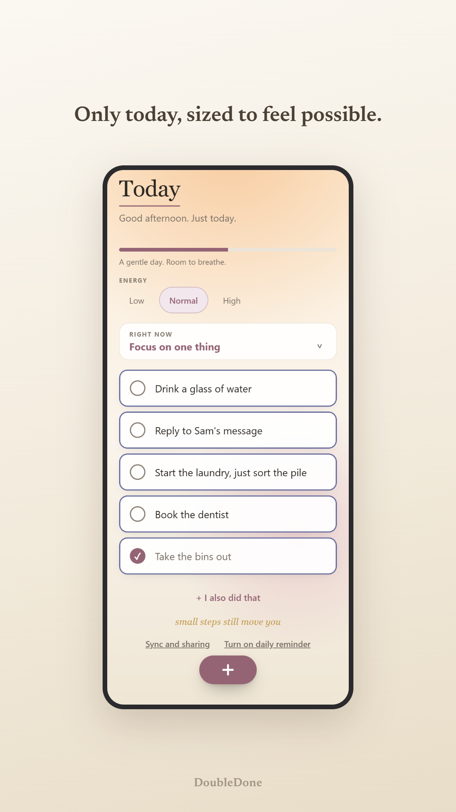
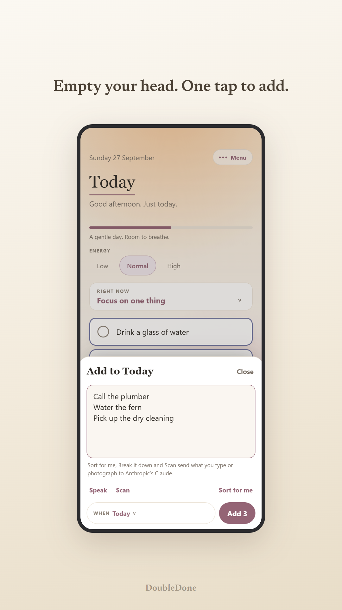
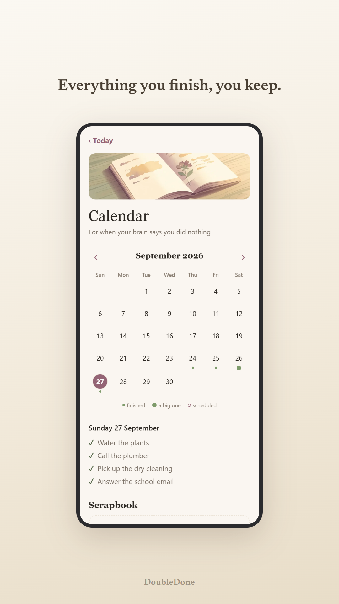
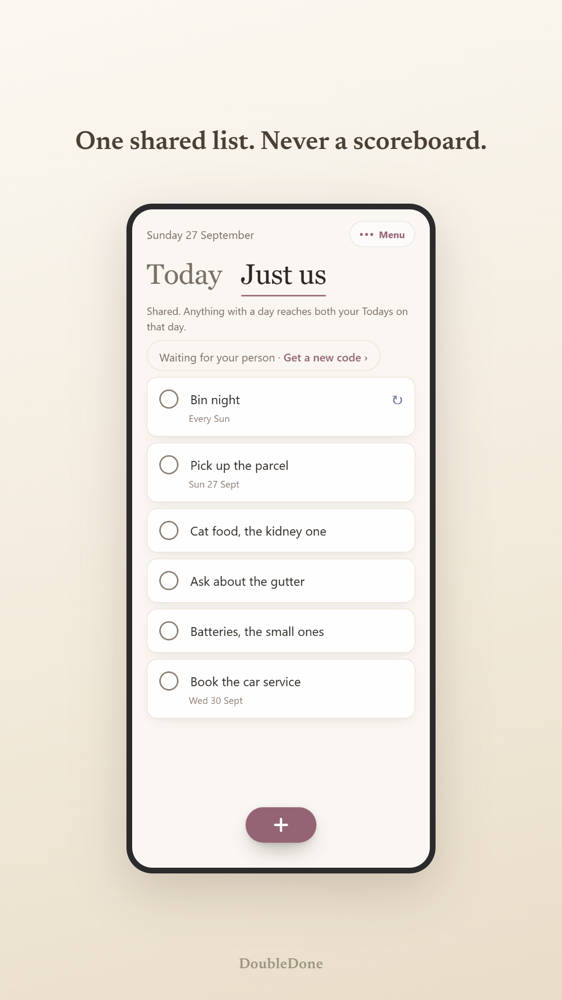
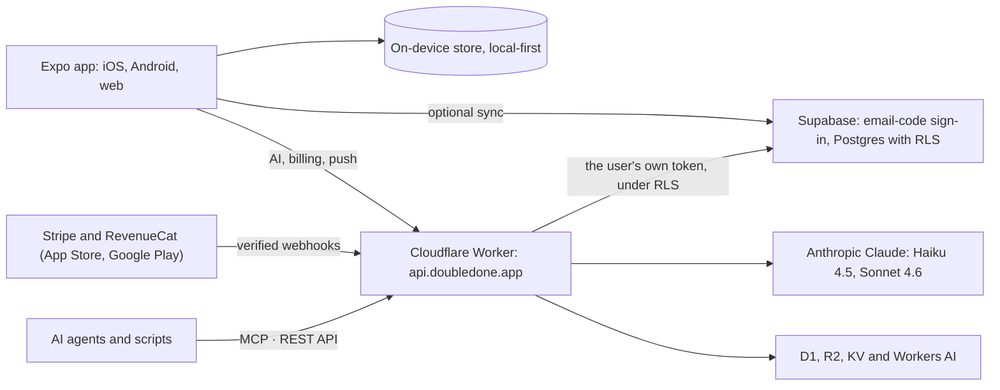

# DoubleDone

[](https://github.com/melroyds/doubledone/actions/workflows/ci.yml)

DoubleDone is a calm daily to-do app for people who find ordinary to-do apps overwhelming: people with ADHD, autism or both, people with OCD, and anyone living with chronic overwhelm. The home screen is Today, and Today is sized to be finishable. You empty your head into one box, the app helps you choose what belongs to today and start the thing you have been avoiding, and at the end it shows you everything you actually finished. One rule sits under every screen: **never shame the backlog**. Nothing turns red, nothing is "overdue", and an old task is celebrated when it closes, never punished for existing.

## Status

DoubleDone is live and has paying subscribers.

| Where | State (5 October 2026) |
|---|---|
| Web | [doubledone.app](https://doubledone.app), deployed from `main` on every push. It already runs 1.8.0. |
| [App Store](https://apps.apple.com/app/id6790136615) | 1.7.0 is live. 1.8.0 (build 41) is with App Review. |
| [Google Play](https://play.google.com/store/apps/details?id=app.doubledone) | 1.7.0 is live. 1.8.0 (versionCode 35) goes through closed testing, then Production. |

The daily loop is free. Premium is sold through each platform's own checkout: Stripe on the web, Apple in-app purchase on iOS and Google Play Billing on Android, with RevenueCat carrying the two store purchases to the server. 1.8.0 adds "Where you left off" and a round of finishing fixes ([release notes](docs/release-notes/1.8.0.md)).

<p align="center">
  
  &nbsp;
  
  &nbsp;
  
  &nbsp;
  
</p>
<p align="center"><em>Today, capture, the Calendar of everything finished, and Ours, the list you share with one other person.</em></p>

## What it does

**The core loop**

1. **Capture.** Tap the + and empty your head, one line per thing. Type it, speak it (on the web), share text in from another app, or photograph a written list (Premium).
2. **Shape it.** "Sort for me" splits a brain dump into today, later and break-it-down. "Tidy this into tasks" turns one run-on line into separate tasks.
3. **Start the hard one.** "Break it down" asks three short questions, then proposes steps you review before anything is added. The original task stays as a quiet parent and completes itself when its steps are done. "Make it tiny" offers a two-minute first step.
4. **Work the day.** A gauge shows how full today is against the energy you chose. One "Right now" tool fits the hour, and the rest are a tap away: Plan my day, Focus on one thing (the "Just this one" view), Lighten today, Settle and Close the day.
5. **Close the day.** A gentle wrap of what you finished, room to log anything else you did, and a place to set down thoughts for tomorrow. Unfinished things simply carry over.
6. **Look back.** The Calendar shows every day's finished tasks, the long-dreaded ones included. It exists for the moment your brain says you did nothing.

**Around it**

- **Repeats and steps.** Daily, chosen weekdays, every few days or monthly, managed in the Repeating room. Any task can be tracked in 2 to 50 parts.
- **Held card.** Long-press a task to break it down, make it tiny, mark it as a lot, move it, back-date a finish, pin it (Premium), or leave yourself one line under **Where you left off**. On phones it also offers Remind me and **Hold me to it**: a few calm knocks through the day, then one each morning, until it is done or you let it go.
- **What fits right now?** One question about how much you have left, and the AI picks one task to start with. Fifteen picks a month free, unlimited with Premium.
- **Routines and Rhythms.** Calm checklists that reset each day, and gentle repeating nudges (water, meds, a stretch) on phones. No streaks and nothing to keep count of.
- **Ours.** One shared list for you and one other person, joined by an invite code once you are both signed in. Anything given a day lands on both Todays. A tick records when, never who.
- **Settle.** A breathing room with an optional guide. Never gated, never opened for you.
- **Scrapbook.** An AI still-life keepsake of a finished week, shareable as one image. One a month free, weekly with Premium.
- **Comfort.** Light and dark, text size, reduced motion, the borderless Quiet interface, and seven colour themes (Dusk is free, the other six are Premium). Five languages: English, German, Spanish, French and Italian, picked from the device.
- **Phones and the web.** An optional daily reminder (phone notifications, or web push), an Android home-screen widget, launcher shortcuts, and share-in from the Android share sheet, the iOS share extension or the installed web app.
- **AI off.** One switch in Settings removes every generative AI feature, and the app runs without it.
- **Your data.** No account needed. Optional email-code sign-in syncs across devices. Export your tasks to JSON, or delete your account and data from Settings.
- **For agents and developers.** An [MCP server](docs/mcp.md) with nine tools (OAuth 2.1 sign-in, or a pasted token) and a [REST API](docs/api.md) (OpenAPI 3.1, v1.2.3, with [Swagger UI](https://api.doubledone.app/api/v1/docs)). Both act only on your own tasks with your own token.

**Premium** adds Scan, Pin, the colour themes, Chart a course (a goal turned into ordered steps), Plan my day, Your patterns, unlimited energy matching and weekly scrapbooks. A signed-in account can take one card-free month to try it. On the web Premium is A$5 a month or A$50 a year. The App Store and Google Play show their own local price. Break it down, Make it tiny, Lighten today, Sort for me, the Calendar, Routines, Rhythms, Ours, Settle and Quiet stay free.

## How it is built

One Expo codebase builds the iOS app, the Android app and the web app. The list is kept on the device first, so the whole app works with no account. Supabase handles optional sign-in and sync, with row-level security on every table. A single Cloudflare Worker at `api.doubledone.app` is the only component that holds the Anthropic key. It serves the AI routes, billing and entitlements, web push, the MCP server and the REST API, and runs an hourly health check.


```mermaid
flowchart LR
    App["Expo app: iOS, Android, web"]
    Local[("On-device store, local-first")]
    SB["Supabase: email-code sign-in, Postgres with RLS"]
    W["Cloudflare Worker: api.doubledone.app"]
    AI["Anthropic Claude: Haiku 4.5, Sonnet 4.6"]
    CF["D1, R2, KV and Workers AI"]
    Pay["Stripe and RevenueCat (App Store, Google Play)"]
    Agents["AI agents and scripts"]

    App --> Local
    App -->|"optional sync"| SB
    App -->|"AI, billing, push"| W
    W --> AI
    W --> CF
    W -->|"the user's own token, under RLS"| SB
    Pay -->|"verified webhooks"| W
    Agents -->|"MCP · REST API"| W
```

The web build is served by Cloudflare Pages, and the store builds come from EAS. The full picture, with every route, table and data flow, is in [docs/architecture.md](docs/architecture.md).

## Tech stack

| Layer | Choice |
|---|---|
| App | Expo SDK 56, React Native 0.85, React 19, expo-router, TypeScript |
| Local store | AsyncStorage (localStorage on the web) |
| Accounts and sync | Supabase Auth with a six-digit email code, Postgres with row-level security |
| Server | One Cloudflare Worker, with `jose` for token verification and `@cloudflare/workers-oauth-provider` for MCP sign-in |
| Server data | Cloudflare D1 (telemetry, outcomes, entitlements, push), R2 (keepsake images), KV (OAuth) |
| AI | Anthropic Claude Haiku 4.5 and Sonnet 4.6, with forced tool use on every route that returns structured data. Workers AI draws the keepsake image (FLUX.1 schnell), with Llama 3.2 3B as a fallback scene writer. |
| Payments | Stripe on the web. RevenueCat for Apple in-app purchase and Google Play Billing. |
| Notifications | `expo-notifications` on phones, Web Push (VAPID) on the web |
| Hosting and builds | Cloudflare Pages for the web. EAS Build for iOS and Android, EAS Submit for iOS. |
| Quality | Vitest, ESLint, `tsc`, gitleaks, GitHub Actions |

## Repository layout

```
client/              Expo app: iOS, Android and web from one codebase
  src/app/           expo-router screens (index is the web landing page, today is the home screen)
  src/components/    UI pieces such as CaptureSheet, TaskRow, BreakdownReview and Bloom
  src/lib/           pure logic with co-located tests, plus the platform-split files
  src/lib/catalogs/  the five language catalogues
  src/widget/        the Android home-screen widget
  public/            static web files: privacy, terms, manifest, service worker, version.json
server/              the Cloudflare Worker, doubledone-ai
  src/               routes, AI prompts, billing, MCP, REST API and the monitor, tests beside each file
  d1/                the D1 schema and its one-off migration
  wrangler.jsonc     bindings, rate limits and the hourly cron
supabase/            Postgres schema and RLS, the shared-list SQL, auth setup notes
scripts/             screenshots, store assets, web meta, version stamp, migration check, test-suite generator
docs/                product, architecture, API, MCP, operations, QA and store material
patches/             a patch-package fix for expo-notifications
.githooks/           the pre-commit Inspector and a commit-msg reminder
.github/workflows/   CI and the web deploy
```

## Running it locally

You need Node 22, the version CI uses (the repo itself pins none), and npm. [gitleaks](https://github.com/gitleaks/gitleaks) is optional but recommended, because the pre-commit Inspector runs it when it is installed. Python 3 is needed only for the scripts in `scripts/` that end in `.py`.

From the repo root (an npm workspaces monorepo, so one install covers `client/` and `server/`):

```bash
npm install          # installs both workspaces and applies the patches
npm run setup        # turns on the git hooks in .githooks/
npm run dev          # the web app, at http://localhost:8081
npm run android      # Expo on an Android emulator or device
```

For iOS, run `npm --workspace client run ios` on a Mac.

The same gates the Inspector and CI run, from the root:

```bash
npm test             # client, then server
npm run typecheck    # client, then server
npm run lint         # client
npm run test:coverage
```

**Client config.** Copy [`.env.example`](.env.example) to `client/.env`. With nothing set, the app runs fully local with no account, and the AI features call the live Worker. The keys the code reads:

- `EXPO_PUBLIC_SUPABASE_URL` and `EXPO_PUBLIC_SUPABASE_ANON_KEY` turn on sign-in and sync.
- `EXPO_PUBLIC_AI_URL` points at a different Worker (it defaults to `https://api.doubledone.app`).
- `EXPO_PUBLIC_VAPID_KEY` overrides the web push public key.
- `EXPO_PUBLIC_RC_IOS_KEY` and `EXPO_PUBLIC_RC_ANDROID_KEY` are the RevenueCat public SDK keys for the store builds.
- `EXPO_PUBLIC_PREMIUM_DEV=true` shows the Settings Premium override in a preview build. Development builds always show it, and production never sets it.

Every `EXPO_PUBLIC_` value is bundled into the app, so none of them is a secret. `EXPO_PUBLIC_APP_NAME`, `EXPO_PUBLIC_STRIPE_PUBLISHABLE_KEY` and `LOG_LEVEL` are in the example file but not read by the code today.

**The Worker.** `npm run dev -w server` runs it with `wrangler dev`. Local secrets go in `server/.dev.vars`, which is gitignored, and Workers AI only runs with `--remote`. The core secrets are `ANTHROPIC_API_KEY`, `SUPABASE_URL` and `SUPABASE_ANON_KEY`. Billing uses `STRIPE_SECRET_KEY`, `STRIPE_WEBHOOK_SECRET`, `RC_WEBHOOK_AUTH`, `RC_WEBHOOK_HMAC` and `RC_SECRET_KEY`. MCP sign-in uses `MCP_GRANT_KEY`, web push uses `VAPID_PRIVATE_KEY` and `VAPID_SUBJECT`, and operations use `FEEDBACK_TO`, `HEARTBEAT_URL` and `ANALYTICS_TOKEN`. `COMP_EMAILS` and `SANDBOX_GRANT_UIDS` are optional allowlists (complimentary Premium, and test purchases that may grant it). Bindings, vars and rate limits live in [`server/wrangler.jsonc`](server/wrangler.jsonc). To point the app at a local Worker, set `EXPO_PUBLIC_AI_URL` to the address `wrangler dev` prints. The Worker accepts browser calls from `http://localhost:8081`.

**Databases.** The D1 schema is [`server/d1/schema.sql`](server/d1/schema.sql), applied with `npm exec -w server -- wrangler d1 execute doubledone-telemetry --remote --file d1/schema.sql`. The Supabase files in [`supabase/`](supabase) are applied by hand in the SQL editor, and `python scripts/check-migrations.py` reports which of them are live without writing anything.

## Testing and quality gates

- **1,918 automated tests in 102 files**, all passing on 5 October 2026: 1,230 client tests in 65 files and 688 server tests in 37 files, run with Vitest. Client tests cover pure logic, and the AI request contract is tested against mocked calls, so CI never calls a live model.
- **Coverage floors**, enforced in CI: 90% lines, functions and statements and 85% branches on `client/src/lib`, and 70% lines and statements, 85% functions and 73% branches on the server ([client config](client/vitest.config.ts), [server config](server/vitest.config.ts)).
- **Typecheck is a hard gate** for both workspaces. [`platform-split.contract.ts`](client/src/lib/platform-split.contract.ts) fails it when an iOS or Android file drifts from its base, and [`schema-drift.test.ts`](client/src/lib/schema-drift.test.ts) keeps the SQL that lives in two files in step.
- **The pre-commit Inspector** ([`.githooks/pre-commit`](.githooks/pre-commit)) runs lint, typecheck, the tests and a secret scan, plus gitleaks when it is installed. The house rule is never to skip it with `--no-verify`.
- **CI** ([`ci.yml`](.github/workflows/ci.yml)) runs on every push and pull request to `main`: lint, typecheck, tests with coverage, a full-history gitleaks scan, and a web export that checks the injected page meta and the stamped version.
- **A manual end-to-end suite of 477 cases** (225 P1, 212 P2, 40 P3) in [`docs/qa/`](docs/qa), generated from [`scripts/gen-test-suite.py`](scripts/gen-test-suite.py). The house rule is that every user-facing feature adds its cases there in the same commit.

What is tested and why is in [docs/testing.md](docs/testing.md). The build discipline behind all this is in [PLAYBOOK.md](PLAYBOOK.md).

## Releases

- **Web.** Every push to `main` runs [`deploy-web.yml`](.github/workflows/deploy-web.yml): an Expo web export, the page meta injected by [`scripts/inject-web-meta.mjs`](scripts/inject-web-meta.mjs), the version stamped by [`scripts/stamp-version.mjs`](scripts/stamp-version.mjs), then a Cloudflare Pages deploy. The deploy does not wait for CI, so the local Inspector is the gate before a push.
- **Stores.** EAS Build makes the iOS build and the Android app bundle from `client/` with the `production` profile in [`client/eas.json`](client/eas.json). EAS holds the build numbers and increments them. iOS goes through EAS Submit to TestFlight and App Review. The Android bundle is uploaded to a Play testing track first, then promoted to Production. Store notes for recent releases live in [`docs/release-notes/`](docs/release-notes).
- **The update nudge** reads [`client/public/version.json`](client/public/version.json). The `web` value is stamped at deploy, so the committed one is a placeholder. The `ios` and `android` values are raised by hand once a release is live in that store.
- **The Worker** is deployed by hand with `npx wrangler deploy` from `server/`, before any client that calls a new route.

## Privacy and security

DoubleDone is local-first and anonymous by default: with no account, your list lives on your device. Signing in (an email and a six-digit code, no password) turns on sync, and row-level security scopes every personal row to its owner and every shared list to its two members. AI features run only when you tap them, send only the text you chose, and can be switched off entirely. The Anthropic key never leaves the Worker. The Worker keeps a pseudonymous log of AI calls (the input text, with no user id or IP address), counts feature use as daily totals, and verifies each bearer token's signature before it acts on an account. The plain-English [privacy policy](https://doubledone.app/privacy) sets out what leaves the device and when, [SECURITY.md](SECURITY.md) explains how to report a vulnerability, and [docs/architecture.md](docs/architecture.md) has the detail.

## Documentation

| Document | What it covers |
|---|---|
| [docs/README.md](docs/README.md) | The index of everything in `docs/` |
| [docs/architecture.md](docs/architecture.md) | The solution architecture: components, routes, data stores and flows |
| [docs/api.md](docs/api.md) | The public REST API, `/api/v1`, with OpenAPI 3.1 and Swagger UI |
| [docs/mcp.md](docs/mcp.md) | The MCP server: both sign-in paths, the nine tools, connecting an agent |
| [docs/testing.md](docs/testing.md) | The testing strategy, the gates and the manual suite |
| [docs/operations.md](docs/operations.md) | Running the live service: the monitor, billing runbooks, releases |
| [docs/product-spec.md](docs/product-spec.md) | What DoubleDone is, who it is for, and why it is shaped this way |
| [decision-log.md](decision-log.md) | The why-trail, including what was decided against |
| [CHANGELOG.md](CHANGELOG.md) | Notable changes by release |
| [SECURITY.md](SECURITY.md) | Reporting a vulnerability, and how data is protected |
| [docs/qa/](docs/qa) | The manual end-to-end suite |

## Licence

MIT. See [LICENSE](LICENSE). Copyright (c) 2026 Melroy D'Souza.

## Who built it

DoubleDone is built and run by Melroy D'Souza in Melbourne. He does not have ADHD himself. He built it out of care for people he works with, has managed and is friends with who have ADHD and OCD, and that closeness shapes every calm, shame-free decision in it.
