# DoubleDone solution architecture

DoubleDone is a calm daily to-do app for people who find a full list overwhelming: ADHD, autism, OCD and chronic overwhelm. Its home screen is Today, sized to be doable. This page describes how the system is built, for an engineer who wants to work on it and for anyone who wants to see how the product decisions show up in the code.

Every claim here is meant to be true of the code on `main`, and each section links to the files that prove it. Where a detail matters, follow the link rather than trusting the prose.

**Where things stand (5 October 2026).** DoubleDone is live on the web at [doubledone.app](https://doubledone.app), on the App Store and on Google Play, with paying subscribers. Release 1.7.0 is live in both stores. Release 1.8.0 is with the stores (iOS build 41 at App Review, Android versionCode 35 in closed testing ahead of Production). The web always runs whatever is on `main`.

## Contents

1. [System context](#1-system-context)
2. [Containers and components](#2-containers-and-components)
3. [Data and privacy boundaries](#3-data-and-privacy-boundaries)
4. [Key flows](#4-key-flows)
5. [Delivery](#5-delivery)
6. [Security model](#6-security-model)
7. [Key decisions and trade-offs](#7-key-decisions-and-trade-offs)
8. [Where to read next](#8-where-to-read-next)

## At a glance

| Layer | What it is | Where it lives |
|---|---|---|
| Client | One Expo codebase (SDK 56, React Native 0.85, React 19, expo-router) built for iOS, Android and the web | [`client/`](../client) |
| Local data | A local-first store on the device (AsyncStorage, which is `localStorage` on the web). The app works fully without an account | [`client/src/lib/storage.ts`](../client/src/lib/storage.ts) |
| Web host | Cloudflare Pages serving a single-page app, deployed on every push to `main` | [`.github/workflows/deploy-web.yml`](../.github/workflows/deploy-web.yml) |
| Backend | One Cloudflare Worker, `doubledone-ai`, at `api.doubledone.app`. The only component that holds the Anthropic key | [`server/src/index.ts`](../server/src/index.ts), [`server/wrangler.jsonc`](../server/wrangler.jsonc) |
| Accounts and sync | Supabase: passwordless email sign-in, and Postgres with row-level security (RLS) | [`supabase/`](../supabase) |
| Server-side stores | Cloudflare D1 (telemetry, entitlements, OAuth custody), R2 (keepsake images), KV (the OAuth provider's store) | [`server/d1/schema.sql`](../server/d1/schema.sql) |
| AI | Claude Haiku 4.5 and Claude Sonnet 4.6 through the Anthropic API. Cloudflare Workers AI for keepsake images | `server/src/*.ts` |
| Payments | Stripe on the web. Apple in-app purchase on iOS and Google Play Billing on Android, both through RevenueCat. One entitlement row per account in D1 | [`server/src/stripe.ts`](../server/src/stripe.ts), [`server/src/revenuecat.ts`](../server/src/revenuecat.ts) |
| Agent surfaces | A remote MCP server and a public REST API (OpenAPI 3.1), both acting only as the signed-in user | [`docs/mcp.md`](mcp.md), [`docs/api.md`](api.md) |
| Native builds | Expo Application Services (EAS) builds, submitted to the App Store and Google Play | [`client/eas.json`](../client/eas.json) |

---

## 1. System context

Three kinds of people use DoubleDone: someone on an iPhone, someone on Android, and someone in a browser. A fourth kind of caller is an AI agent (Claude, ChatGPT, Cursor and others) that a person has connected to their own tasks.

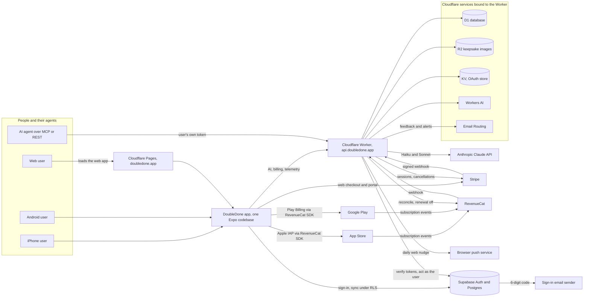

### The external services, and what each one is for

| Service | Used for | Who talks to it | Code |
|---|---|---|---|
| Supabase Auth | Passwordless sign-in with a 6-digit email code. Issues the JWTs every other surface checks | The app. The Worker reads its public signing keys (JWKS) and runs the MCP sign-in page against it | [`client/src/app/sign-in.tsx`](../client/src/app/sign-in.tsx), [`server/src/verify.ts`](../server/src/verify.ts) |
| Supabase Postgres | Synced tasks, keepsake records and the shared lists (Ours), every table under RLS | The app directly with the user's token. The Worker only ever as the user, never with an elevated key | [`supabase/schema.sql`](../supabase/schema.sql), [`supabase/ours.sql`](../supabase/ours.sql) |
| Sign-in email sender | Delivers the sign-in code. Configured in the Supabase dashboard as custom SMTP | Supabase Auth | [`supabase/auth-setup.md`](../supabase/auth-setup.md), [`supabase/email-templates/otp-code.html`](../supabase/email-templates/otp-code.html) |
| Cloudflare Pages | The web app, the static privacy and terms pages, the service worker and `version.json` | Browsers, and every build reading `version.json` | [`client/public/`](../client/public) |
| Cloudflare Worker | Every AI call, billing, both webhooks, the REST API, the MCP server, web push and the hourly monitor | The app, AI agents, Stripe, RevenueCat and its own cron | [`server/src/index.ts`](../server/src/index.ts) |
| Cloudflare D1 | Telemetry, entitlements, trials, MCP token custody, webhook logs, web push subscriptions | The Worker only. There is no public write path | [`server/d1/schema.sql`](../server/d1/schema.sql) |
| Cloudflare R2 | Keepsake (scrapbook) images | The Worker writes. Anyone holding an image URL can read it | [`server/src/index.ts`](../server/src/index.ts) |
| Cloudflare KV | The OAuth provider's clients, grants and token hashes, plus the MCP Break-it-down hourly counter | The Worker only | [`server/src/oauth.ts`](../server/src/oauth.ts), [`server/src/mcp.ts`](../server/src/mcp.ts) |
| Cloudflare Workers AI | The keepsake image (`flux-1-schnell`) and the fallback scene writer (`llama-3.2-3b-instruct`) | The Worker | [`server/src/scrapbook.ts`](../server/src/scrapbook.ts) |
| Cloudflare Email Routing | Outbound mail to the support inbox (in-app feedback, monitor alerts, money alerts), and inbound mail for the App Review sign-in code relay | The Worker | [`server/src/feedback.ts`](../server/src/feedback.ts), [`server/src/monitor.ts`](../server/src/monitor.ts), [`server/src/review-otp.ts`](../server/src/review-otp.ts) |
| Anthropic Claude API | Haiku 4.5 for quick shaping, Sonnet 4.6 for planning. No Opus model is called anywhere | The Worker only | `server/src/*.ts` (each route's `*_MODEL` constant) |
| Stripe | Web subscriptions: Checkout, the Billing Portal, cancellation on account deletion | The web app opens Stripe's hosted pages. The Worker calls the API and receives the webhook | [`server/src/stripe.ts`](../server/src/stripe.ts) |
| RevenueCat | StoreKit and Play Billing plumbing for the native apps, a webhook into the Worker, and a read-and-cancel API the Worker calls | The native SDK, and the Worker | [`client/src/lib/purchases.ios.ts`](../client/src/lib/purchases.ios.ts), [`client/src/lib/purchases.android.ts`](../client/src/lib/purchases.android.ts), [`server/src/revenuecat.ts`](../server/src/revenuecat.ts) |
| App Store and Google Play | Distribution, and billing for the native apps | People installing, and EAS builds | [`client/eas.json`](../client/eas.json) |
| Browser push service | Carries the payloadless daily nudge to a browser that opted in | The Worker sends, the service worker shows a fixed message | [`server/src/webpush.ts`](../server/src/webpush.ts), [`client/public/sw.js`](../client/public/sw.js) |
| Heartbeat monitor (optional) | A dead-man's switch, pinged every hour when the `HEARTBEAT_URL` secret is set | The Worker's cron | [`server/src/monitor.ts`](../server/src/monitor.ts) |
| AI agents | MCP clients (claude.ai, Claude Desktop, Claude Code, Cursor, ChatGPT) and REST callers | The Worker, with the person's own token | [`docs/mcp.md`](mcp.md), [`docs/api.md`](api.md) |

---

## 2. Containers and components

### 2.1 The Expo client

The client is an npm workspace in [`client/`](../client). Screens are expo-router routes in [`client/src/app`](../client/src/app). Pure logic lives in [`client/src/lib`](../client/src/lib), next to its tests. The rules that matter (what shows on Today, how sync merges, who may buy) are kept out of the screens on purpose, as plain functions under test.

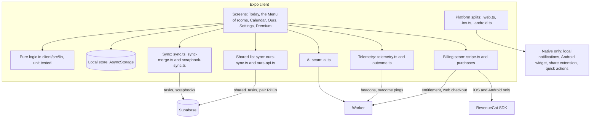

**The screens.** There is no tab bar on purpose: Today is home, and everything else is a room reached from the Menu ([`_layout.tsx`](../client/src/app/_layout.tsx) is one stack).

| Route | File | What it is |
|---|---|---|
| `/` | [`index.tsx`](../client/src/app/index.tsx) | The web landing page for a first-time visitor. Native apps and returning web users go straight to Today |
| `/today` | [`today.tsx`](../client/src/app/today.tsx) | Today: capture, the day tools, the held card, Focus, Close the day, and the "Today · Ours" heading |
| `/welcome` | [`welcome.tsx`](../client/src/app/welcome.tsx) | The first run, replayable from Settings |
| `/rooms` | [`rooms.tsx`](../client/src/app/rooms.tsx) | The Menu, "The rest of the house" |
| `/lookback` | [`lookback.tsx`](../client/src/app/lookback.tsx) | The Calendar, Your patterns, Reflect on this week and the scrapbook |
| `/routines`, `/repeating` | [`routines.tsx`](../client/src/app/routines.tsx), [`repeating.tsx`](../client/src/app/repeating.tsx) | Routines and Rhythms, and the repeating series |
| `/ours`, `/ours-list` | [`ours.tsx`](../client/src/app/ours.tsx), [`ours-list.tsx`](../client/src/app/ours-list.tsx) | Pairing for the shared list, and the shared list itself |
| `/chart`, `/settle` | [`chart.tsx`](../client/src/app/chart.tsx), [`settle.tsx`](../client/src/app/settle.tsx) | Chart a course, and the breathing room |
| `/settings`, `/premium`, `/sign-in` | [`settings.tsx`](../client/src/app/settings.tsx), [`premium.tsx`](../client/src/app/premium.tsx), [`sign-in.tsx`](../client/src/app/sign-in.tsx) | Settings, the paywall and subscription status, and the email-code sign-in |
| `/privacy`, `/terms` | [`privacy.tsx`](../client/src/app/privacy.tsx), [`terms.tsx`](../client/src/app/terms.tsx) | The policies in English, twinned by static pages in `client/public/` |
| `/share-target` | [`share-target.tsx`](../client/src/app/share-target.tsx) | Where the installed web app receives shared text. Nothing is added without a yes |

**Languages.** The interface ships in English, German, Spanish, French and Italian ([`i18n.ts`](../client/src/lib/i18n.ts), with one catalogue per language in [`catalogs/`](../client/src/lib/catalogs)). Every catalogue is typed against English, so a missing key fails the typecheck, and at runtime a missing key falls back to English. The language is read once from the device at startup ([`locale.ts`](../client/src/lib/locale.ts)), and there is no in-app picker. AI features are asked to answer in the same language. The `Intl` features Android's Hermes engine lacks (plural rules, relative time) have pure fallbacks. The privacy policy and terms stay in English.

**Local-first, anonymous-first.** Everything a person makes lives on the device first, under `doubledone.*` keys ([`storage.ts`](../client/src/lib/storage.ts)). Every load is defensive (a corrupt value becomes empty rather than a crash) and every save is caught, so storage can never take a screen down. The Supabase client exists only when `EXPO_PUBLIC_SUPABASE_URL` and `EXPO_PUBLIC_SUPABASE_ANON_KEY` are set ([`supabase.ts`](../client/src/lib/supabase.ts)). Without them, or without signing in, the app runs entirely on the device. Signing in is optional and adds sync, the shared list and the paid features that need an account.

**Platform splits.** Metro picks a `.web.ts`, `.ios.ts` or `.android.ts` file over its base file at bundle time. The usual convention is native code in the base file and a web stub in `.web.ts` (haptics, reminders, share, share intent, speech, keepsake capture, the widget). Purchases deliberately invert it: the base [`purchases.ts`](../client/src/lib/purchases.ts) is the inert web stub, and the real code lives in [`purchases.ios.ts`](../client/src/lib/purchases.ios.ts) and [`purchases.android.ts`](../client/src/lib/purchases.android.ts), the only files that import `react-native-purchases`.

| Split | Web | iOS | Android |
|---|---|---|---|
| Purchases | Inert stub, `IAP_AVAILABLE = false` | Apple IAP through RevenueCat. An anonymous purchase is allowed | Play Billing through RevenueCat. An account is required before buying |
| Storefront switches ([`storefront.ts`](../client/src/lib/storefront.ts), [`storefront.android.ts`](../client/src/lib/storefront.android.ts)) | Stripe allowed | Stripe allowed | No Stripe surface and none of our own fixed prices. Prices come only from Play's own price string |
| Reminders | One daily Web Push nudge | Local notifications | Local notifications on their own channels |
| Speak (dictation) | Web Speech API | Not offered | Not offered |
| Share into the app | PWA share target | Share extension (text and links) | Android share sheet (`text/*`) |
| Home-screen widget | None | None | Today widget |

TypeScript only reads the base file of a split, so a name missing from a platform file would compile clean and be `undefined` on a phone. [`platform-split.contract.ts`](../client/src/lib/platform-split.contract.ts) closes that gap for `purchases` and `storefront`: `npm run typecheck` fails unless each pair exports the same names with compatible types.

### 2.2 Cloudflare Pages, the web host

- The web build is a single-page app (`web.output: "single"` in [`client/app.json`](../client/app.json)). [`client/public/_redirects`](../client/public/_redirects) sends every path to `index.html` so deep links resolve.
- Because single-page output ignores `+html.tsx`, the shipped `<head>` is patched after export by [`scripts/inject-web-meta.mjs`](../scripts/inject-web-meta.mjs): title, social cards, `interactive-widget=resizes-content` for the keyboard, and a small viewport stylesheet. CI greps the exported page for the social image tag, the keyboard setting and the viewport stylesheet, so they cannot silently vanish.
- [`client/public/_headers`](../client/public/_headers) sends HSTS for a year, subdomains included.
- Static files ride alongside the app: `privacy.html`, `terms.html`, `support.html`, `manifest.json` (with the share target), `sw.js` (the push service worker) and `version.json` (the update nudge, section 5).

### 2.3 The Worker

One Worker, [`server/src/index.ts`](../server/src/index.ts), serves the custom domain `api.doubledone.app` (the workers.dev address is switched off). It has three handlers: `fetch` for HTTP, `email` for the inbound App Review code relay, and `scheduled` for an hourly cron.

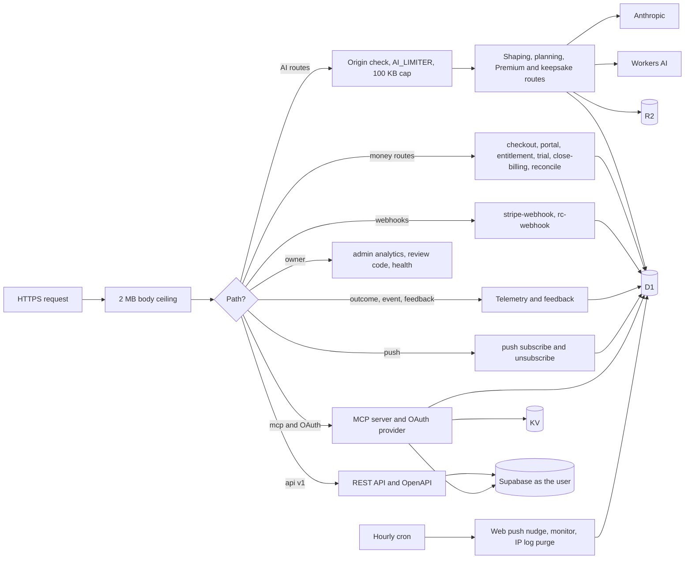

**Request order** (`fetch` in [`index.ts`](../server/src/index.ts)):

1. A declared body over 2,000,000 bytes is refused with 413, on every route.
2. `/mcp/disconnect` is handled first (POST only, foreign browser origins refused).
3. `/mcp` is split by the shape of the bearer. A JWT-shaped token takes the original pasted-token path. Anything else, including no token, goes to the OAuth provider.
4. OAuth paths (`/authorize`, `/token`, `/register` and the two OAuth metadata documents under `/.well-known/`) go to the OAuth provider.
5. Everything else goes to the router.
6. Outside `/api/` (which answers its own 404), an unknown path answers `200 doubledone-ai` in plain text. A 200 therefore proves nothing about whether a route is deployed, which is why a deploy check for a new route expects a 401 without a token.

**Route groups.**

| Group | Routes | Notes |
|---|---|---|
| Shaping AI, Haiku 4.5 | `/clarify`, `/triage` (Sort for me), `/split` (Tidy this into tasks), `/tiny` (Make it tiny), `/combine`, `/energy` (What fits right now?) | No account needed. Guarded by origin, the per-IP `AI_LIMITER` (30 a minute) and a 100 KB body cap |
| Planning AI, Sonnet 4.6 | `/plan` (Break it down), `/strategise` (Lighten today), `/decompose` | `/decompose` is the older single-call breakdown. No app screen calls the route now, and MCP `break_down` reuses its request builder |
| Premium AI | `/ocr` (Scan, Haiku vision), `/chart` (Chart a course), `/sequence` (Plan my day), `/lookback-summary` (Reflect on this week), all Sonnet except `/ocr` | Behind `requirePremium` ([`premium.ts`](../server/src/premium.ts)), which fails closed |
| Keepsakes | `/scrapbook`, `GET /scrapbook-img/:key`, `/scrapbook/purge` | Scene by Haiku with a Workers AI fallback, image by Workers AI, bytes in R2. 20 a day per IP through D1 |
| Money | `/checkout`, `/portal`, `GET /entitlement`, `/trial/start`, `/account/close-billing`, `/apple/reconcile` | Verified bearer on every one ([`stripe.ts`](../server/src/stripe.ts), [`premium.ts`](../server/src/premium.ts), [`revenuecat-api.ts`](../server/src/revenuecat-api.ts)) |
| Webhooks | `/stripe-webhook`, `/rc-webhook` | The signature or shared secret is the authentication |
| Developer surfaces | `/api/v1/*` (with `/api/v1/docs` and `/api/v1/openapi.json`), `/mcp`, `/mcp/disconnect`, the OAuth endpoints | [`api.ts`](../server/src/api.ts), [`openapi.ts`](../server/src/openapi.ts) (OpenAPI 3.1, version 1.2.3), [`mcp.ts`](../server/src/mcp.ts) (nine tools), [`oauth.ts`](../server/src/oauth.ts) |
| Telemetry and feedback | `/outcome`, `/event`, `/feedback` | Origin-gated and rate-limited like the AI routes |
| Web push | `/push/subscribe`, `/push/unsubscribe` | Browser only (origin-gated) |
| Owner | `GET /admin/analytics` (token-gated), `GET /review-code`, `GET /health` | `/health` reports only whether the Anthropic key is wired |

**Every Claude call** goes to the Messages API as a plain `fetch` (there is no Anthropic SDK in the Worker) and sets `max_tokens`. Every route except Reflect on this week forces one named tool, so the reply is structured JSON of bounded size. Reflect asks for one short paragraph of plain text instead ([`lookbackSummary.ts`](../server/src/lookbackSummary.ts)). The `language` field is accepted only from an allowlist (Italian, Spanish, French, German), so it cannot carry instructions into a prompt ([`lang.ts`](../server/src/lang.ts)).

**The hourly cron** (`scheduled`) runs three isolated jobs: the web push nudge for every subscription whose local hour matches ([`push.ts`](../server/src/push.ts)), the health monitor that emails the owner on spend, error, volume and abuse thresholds plus a daily pulse ([`monitor.ts`](../server/src/monitor.ts)), and a purge of scrapbook IP log rows older than 24 hours.

### 2.4 Supabase

- **Auth.** Email one-time codes only. The app calls `signInWithOtp` and then `verifyOtp` with the 6-digit code ([`sign-in.tsx`](../client/src/app/sign-in.tsx)). The session is persisted on the device and refreshed automatically.
- **`public.tasks`.** One row per task, keyed by a client-generated id, with `user_id` referencing `auth.users` (cascade on delete). Soft deletes are tombstones (`deleted_at`). There is no `now()` trigger, by design: the client owns `updated_at`, because last-write-wins needs one writer of the stamp. Four RLS policies, each `auth.uid() = user_id` ([`schema.sql`](../supabase/schema.sql)).
- **`public.scrapbooks`.** One row per user per week: the R2 image URL and a caption. Own-row RLS.
- **`public.delete_account()`.** A security-definer function with an empty `search_path` that deletes the caller's own `auth.users` row, granted to signed-in users only.
- **Ours, the two-person shared list.** `pairs`, `pair_members`, `pair_invites`, `shared_tasks` and `pair_join_attempts` ([`ours.sql`](../supabase/ours.sql), with later files [`ours-resume.sql`](../supabase/ours-resume.sql), [`ours-due.sql`](../supabase/ours-due.sql), [`ours-open.sql`](../supabase/ours-open.sql), [`ours-rename-self.sql`](../supabase/ours-rename-self.sql)). Members read and write `shared_tasks` through membership policies. Pairing, joining, leaving and resuming go through security-definer RPCs. Your own copy of a shared task links back with one column, `tasks.shared_ref` ([`tasks-shared-ref.sql`](../supabase/tasks-shared-ref.sql)).
- **Where you left off** and three formerly device-only task fields arrived as four additive, nullable columns in [`tasks-left-off.sql`](../supabase/tasks-left-off.sql).
- **Migrations** are plain SQL files pasted into the Supabase SQL editor. [`scripts/check-migrations.py`](../scripts/check-migrations.py) proves which are applied by probing PostgREST with the publishable key and reading the error codes. It writes nothing.

### 2.5 D1, R2 and KV

D1 (`doubledone-telemetry`, binding `DB`) is bound only to the Worker. Its schema is [`server/d1/schema.sql`](../server/d1/schema.sql).

| Table | Holds | Identity |
|---|---|---|
| `ai_calls` | One row per AI call: endpoint, model, input, output, tokens, latency, ok, `corr_id` | None. No user id, no IP. Keeps the text the person sent (disclosed in the privacy policy), except Scan, Reflect, Plan my day and energy matching, which log counts and settings only, never text |
| `outcomes` | A finished Break-it-down step: `corr_id`, step total, days from offer to finish | None |
| `app_event_counts` | One counter per day per allowlisted feature name | None |
| `push_subs` | Web push endpoint and keys, preferred hour, timezone offset | None |
| `entitlements` | One row per account: premium, status, period end, Stripe customer, `source` (stripe, apple or google), and the RevenueCat ordering guards | Supabase user id |
| `trials` | The one card-free 30-day trial per account | Supabase user id |
| `rc_events` | Every RevenueCat delivery and what was done with it, from a named allowlist of fields | RevenueCat's app user id as sent, and the resolved Supabase user id |
| `processed_events` | Webhook event ids already applied, for idempotency | None |
| `mcp_grants` | MCP OAuth custody: the user's Supabase refresh token, AES-GCM encrypted, plus a cached access token | User id and email |
| `scrapbook_log` | One row per keepsake for the per-IP daily cap | IP, deleted after 24 hours |
| `alerts_sent` | When each alarm kind last fired, for a 6-hour dedup | None |

`review_otp` (the App Review relay) is created by its own code on first use rather than in the schema file.

R2 (`doubledone-scrapbooks`, binding `SCRAPBOOKS`) holds keepsake JPEGs under random UUID keys, served read-only at `/scrapbook-img/:key` with a long immutable cache. There is no listing route.

KV (`OAUTH_KV`) belongs to `@cloudflare/workers-oauth-provider` (registered clients, grants, token hashes and the library's encrypted props), and also holds the per-user hourly counter for MCP `break_down`.

---

## 3. Data and privacy boundaries

The privacy posture is architectural rather than a promise in copy: the device is the default home, sync is opt-in, the AI sees only what a person chose to send, and telemetry is shaped to carry no account identity.

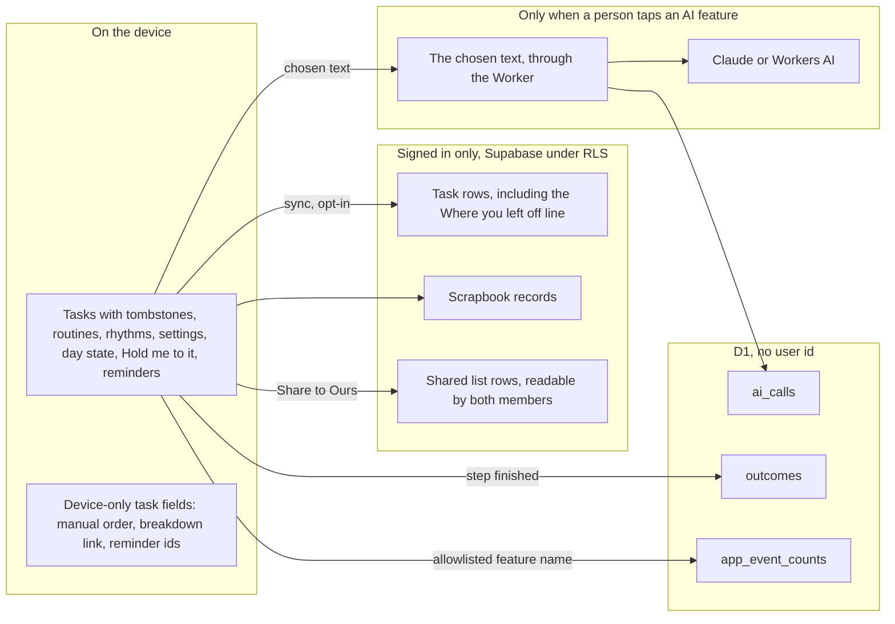

### What lives where

| Data | Device | Supabase | Worker and D1 | Third parties |
|---|---|---|---|---|
| Tasks | Yes, including tombstones | When signed in | Read and written only as the user, through REST or MCP. Text sent to an AI feature is kept in `ai_calls` without identity | The text a person sends to an AI feature goes to Anthropic |
| Where you left off (one line per task, up to 280 characters) | Yes | On the owner's own row (`left_off`) | Never in an AI request, a REST or MCP response, or a shared row | None |
| Routines, rhythms, settings, Hold me to it, reminders, energy picks, day state | Yes | No, never synced | No | None |
| Keepsakes | The image URL and caption | The same record, when signed in | Image bytes in R2 | The week's finished titles go to Claude Haiku (or Workers AI as a fallback) to write a scene, then the scene to Workers AI for the image |
| Shared list (Ours) | A cached copy | `shared_tasks`, both members | No | None |
| Purchases | The store's own entitlement on iOS and Android | No | `entitlements`, `trials`, `rc_events` | Stripe sees the Supabase user id in its metadata, and whatever the buyer enters at Checkout. RevenueCat sees the Supabase user id as its App User ID |
| Web reminders | The subscription | No | `push_subs`, with no user id | The browser's push service delivers a push with no payload |
| Feedback | No | No | Emailed to the support inbox with the platform name | Email delivery |

### What reaches the AI, and what never does

- **Every AI call is something the person tapped.** Nothing runs in the background. AI can be switched off entirely in Settings ([`settings.ts`](../client/src/lib/settings.ts), `aiEnabled`), and then every generative feature disappears and the app runs AI-free.
- **Only the text the feature needs is sent** ([`ai.ts`](../client/src/lib/ai.ts)): a task title and the answers for Break it down, the lines for Sort for me, the day's titles for Lighten today, a goal for Chart a course, a photo for Scan, a finished week's titles for a keepsake or Reflect on this week.
- **No identity reaches Anthropic.** The Worker builds each request from the body alone. The Premium routes verify the account first, but the user id stays in the Worker.
- **Never sent:** the Where you left off line, email addresses, user ids, and the photo for Scan beyond the single call (the image is never stored, and `ai_calls` logs only its size and the number of titles found).
- **Speak** (web only) uses the browser's own speech recognition. Chrome routes that through Google's speech service and Safari runs it on the device ([`speech.web.ts`](../client/src/lib/speech.web.ts)). Only recognised text reaches the capture box.

### Telemetry

- **Feature counts.** [`telemetry.ts`](../client/src/lib/telemetry.ts) writes every `track()` call to the console. Twenty allowlisted names also post to `/event`, with props stripped on the device to a handful of safe values, no auth header, and nothing sent from development builds. The Worker folds each into a daily counter in `app_event_counts` and drops any name it does not recognise ([`events.ts`](../server/src/events.ts)).
- **The completion flywheel.** `/plan` logs the offered breakdown to `ai_calls` with a pseudonymous `corr_id`. When a step from that breakdown is finished, the app posts only the id, the step total and the days elapsed to `/outcome` ([`outcome.ts`](../client/src/lib/outcome.ts)). Joining the two on `corr_id` shows which breakdowns actually get done, without knowing who did them.
- **Not collected:** session lengths, who ticked a shared item (`shared_tasks` has no "done by" column), task text in alerts or event counts, RevenueCat subscriber attributes or IPs.

### Account deletion

[`account.ts`](../client/src/lib/account.ts) runs it in an order that cannot leave someone paying for a deleted account:

1. `POST /account/close-billing` cancels every chargeable Stripe subscription and turns off a Google Play renewal through RevenueCat. Success is only a 200 whose JSON carries a numeric `cancelled`. Anything else stops the deletion before it starts.
2. The `delete_account` RPC removes the Supabase user. Tasks, scrapbooks and pair memberships cascade. Words on a shared list stay with the other person, with the author cleared.
3. Sign out, purge the keepsake images from R2, and wipe the device's local data (display preferences stay).

The Worker cannot cancel an Apple subscription, so the app tells the person to cancel it in their Apple account. D1 keeps the billing records (`entitlements`, `rc_events`, `processed_events`), which the privacy policy discloses. Two other account-keyed D1 rows are not removed by deletion today: the `trials` row, and the `mcp_grants` custody row (email address and encrypted refresh token) of any AI connector that was never disconnected. Custody rows are deleted only by `POST /mcp/disconnect`, or when a newer sign-in supersedes a connection ([`mcp-grants.ts`](../server/src/mcp-grants.ts)).

---

## 4. Key flows

### 4.1 Email code sign-in and the first sync

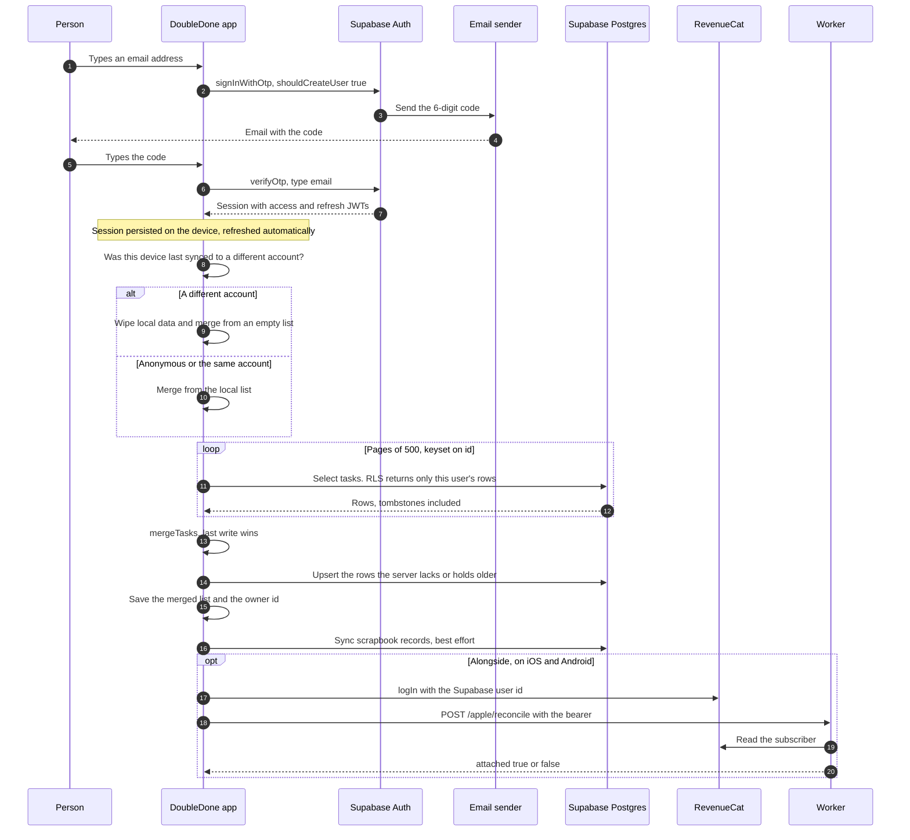

On first sign-in every anonymous task is "local only", so the whole list migrates into the account in the first push. Sync runs whenever Today has finished loading and holds a session (in practice on open and after sign-in), and once more as a flush before sign-out ([`today.tsx`](../client/src/app/today.tsx)). There is no realtime channel and no push on every change. The moment a sync fails, the footer stops naming the account it is synced to and says the changes are waiting, and that state is remembered across launches. If a write fails on the `tasks_user_id_fkey` foreign key, the account was deleted elsewhere, so the device wipes its local data, purges its keepsake images and signs out ([`sync.ts`](../client/src/lib/sync.ts), `isAccountGone`).

### 4.2 The sync merge

[`sync-merge.ts`](../client/src/lib/sync-merge.ts) is pure and fully unit-tested. For each task id seen on either side, the copy with the later `updatedAt` wins. A delete is a tombstone with a newer stamp, so deletions win exactly the way edits do.

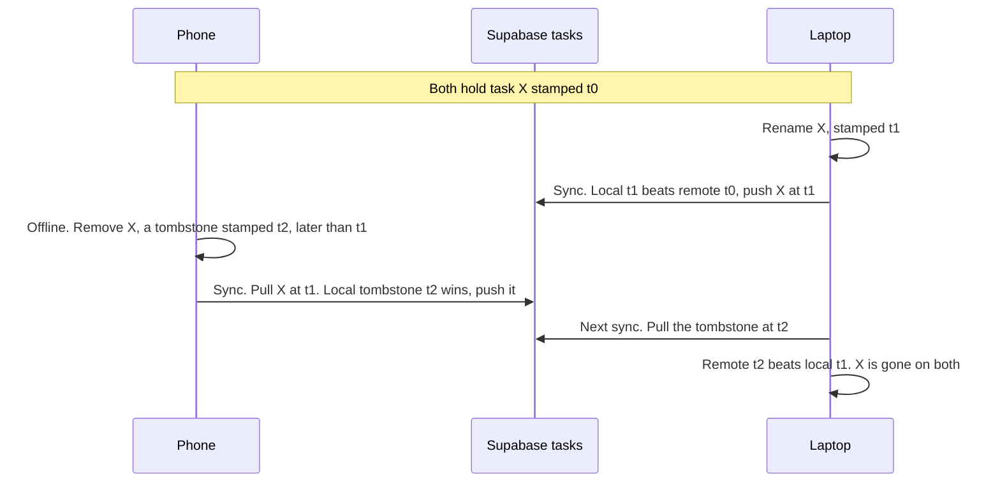

The rules around that core:

- **Progress is never lost to an unrelated edit.** Repeat completions (`completedDates`) are unioned, and step progress (`slices.done`) takes the maximum, whichever copy wins.
- **Device-only fields survive a remote win.** `manualOrder`, the breakdown link (`decompositionId`, `decompositionSteps`), `suggestBreakdown` and the reminder ids have no column, so they are carried from the local copy. A test fails unless every task field is either synced or on that list.
- **A corrupt stamp loses.** A non-finite `updatedAt` ranks lowest, so a damaged row can never pin a task.
- **Clocks are kept honest.** Each write is stamped no earlier than the copy it replaces ([`task-writes.ts`](../client/src/lib/task-writes.ts)), and the device clock is corrected by an offset read from the database's `server_now` RPC ([`clock.ts`](../client/src/lib/clock.ts)). That matters because the MCP server and other devices write on their own clocks.
- **Every column is sent on every upsert** (`taskToRow`), because a batch upsert fills missing keys with null.
- **The pull is keyset-paged** in 500s, because tombstones are never pruned and an unpaged select would be silently truncated.

The shared list uses its own merge in [`ours-merge.ts`](../client/src/lib/ours-merge.ts), with a per-date tick and un-tick log for repeating rows. The list room re-syncs every 15 seconds while it is open and in use, and stops after ten idle minutes ([`ours-sync.ts`](../client/src/lib/ours-sync.ts)).

### 4.3 Break it down: propose-only AI, and the flywheel

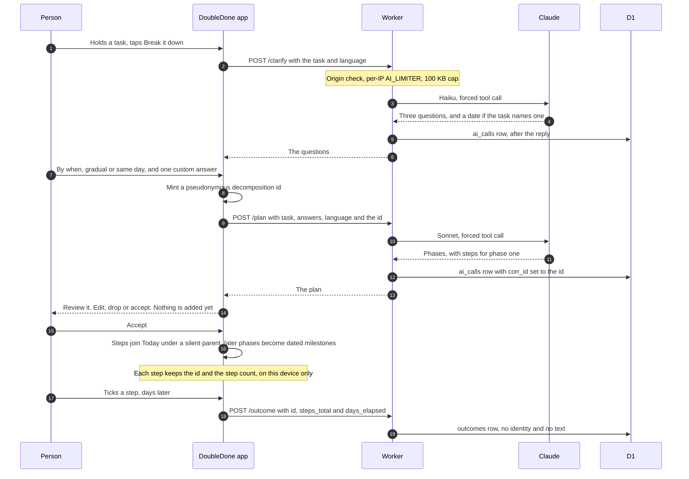

The planning features share the same propose-then-accept shape: Lighten today, Plan my day, Chart a course and What fits right now all suggest, and the person decides what lands. Sort for me is the one exception: tapping it is the opt-in, so it places the sorted lines directly (later ones to tomorrow, anything it drops onto Today) and says what it did. With AI switched off, Break it down offers manual steps instead. Over MCP, the `break_down` tool is propose-only too: it returns steps and adds nothing until the person agrees to `add_task` them.

### 4.4 A purchase and its entitlement, on each storefront

All three storefronts write one place, the D1 `entitlements` row for the account, and all three are read back the same way, through `GET /entitlement`.

**Web, through Stripe**

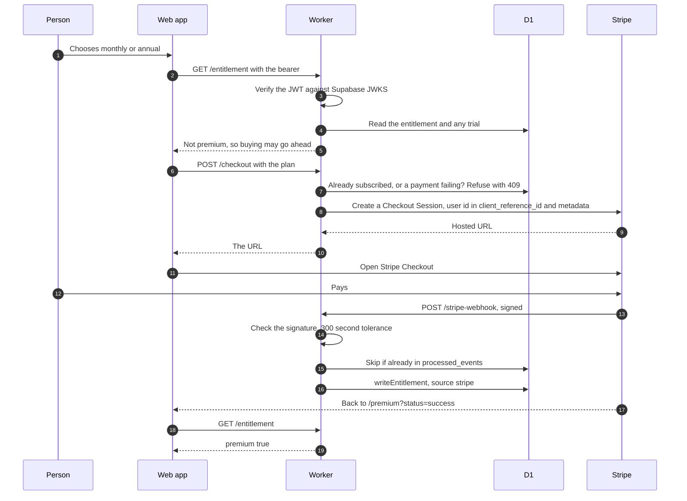

**iOS and Android, through RevenueCat**

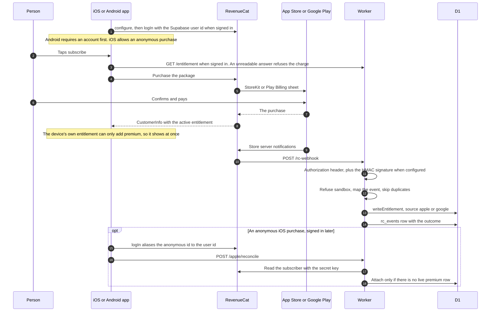

The details that keep money correct:

- **Double-charge guards on both sides.** The paywall re-reads the entitlement immediately before any charge, and a failed read refuses rather than reads as free (`buyCheck` in [`iap.ts`](../client/src/lib/iap.ts)). The Worker's `/checkout` refuses a second subscription while one is live or in dunning, on any store, and answers 503 rather than guess when D1 cannot be read.
- **The webhook mapping** ([`revenuecat.ts`](../server/src/revenuecat.ts)). A cancellation turns auto-renew off and keeps premium to the end of the period. A billing issue keeps premium on as `past_due`. Only an expiry that has actually passed revokes. `writeEntitlement` ([`entitlements.ts`](../server/src/entitlements.ts)) refuses an event older than the last one applied, a non-sale about a different subscription than the live one, and, while premium is on, any other store's write that is not an active renewing sale.
- **Sandbox, TestFlight and Play test purchases** are logged and never applied, except for a short named allowlist of review and tester accounts.
- **What the person sees** comes from the server entitlement merged with the device's own store entitlement ([`premium-provider.tsx`](../client/src/lib/premium-provider.tsx)). The device side can only add premium, which covers the moments before a webhook lands and the anonymous iOS buyer.

**Who may use a Premium AI feature.** The client hides gates for display, but the Worker decides ([`premium.ts`](../server/src/premium.ts)):

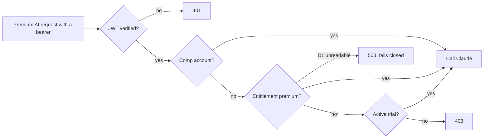

### 4.5 An AI agent connecting over MCP OAuth

Connector interfaces (claude.ai, Claude Cowork, ChatGPT) paste one URL, `https://api.doubledone.app/mcp`, and sign in. This is OAuth 2.1 through `@cloudflare/workers-oauth-provider`, with the Worker's own sign-in and consent page ([`oauth.ts`](../server/src/oauth.ts)).

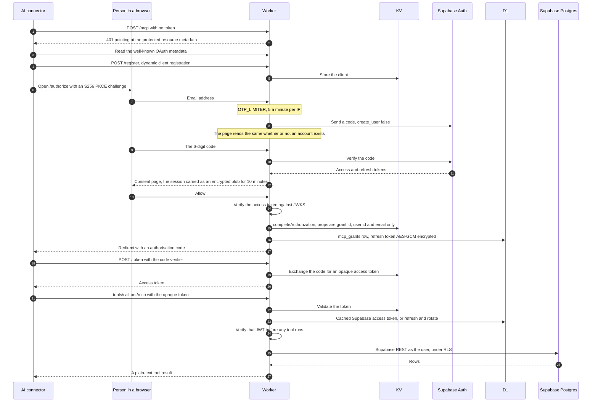

The design choices in that flow. The first three were each learned from a real failure, recorded as the three 2026-07-07 hotfixes in the decision log:

- **The verify-to-consent carry is stateless.** KV is not read-your-write across two requests, so a stashed nonce sometimes went missing between the code step and Allow. The session now rides the consent page as an AES-GCM blob under `MCP_GRANT_KEY`, bounded to ten minutes.
- **`revokeExistingGrants: false`.** Connectors make several authorise attempts while wiring up, and the library default let a later attempt revoke an earlier grant mid-exchange. Superseded connections are cleaned up by deleting their custody instead.
- **A session id for browsers.** `initialize` returns an `Mcp-Session-Id` and CORS exposes it, so claude.ai on the web can mark the connector connected. The server stays stateless: the id is not stored, and the bearer is the only authentication.
- **The kill switch.** Settings, AI agent access, Disconnect AI connectors calls `POST /mcp/disconnect`, which verifies the person's own token and deletes all of their custody rows, so the next tool call fails at once. Provider grants are then revoked as a best effort.

Developer clients (Claude Code, Claude Desktop, Cursor) can instead paste a token copied from Settings. That path sends the person's own Supabase access token as the bearer, which lasts about an hour, and is verified the same way before any tool runs.

The nine tools are `add_task`, `list_today`, `list_upcoming`, `complete_task`, `update_task`, `delete_task`, `break_down`, and `search` and `fetch` (the OpenAI Deep Research connector contract). The REST API ([`api.ts`](../server/src/api.ts)) offers the same task operations without AI, and both surfaces build repeating tasks through one shared cadence engine (`buildRecurrence` in [`cadence.ts`](../server/src/cadence.ts)), which ports the app's own recurrence rules, so a repeat made by an agent or by the API has the same shape as one made in the app. The shared list itself (`shared_tasks`) is not exposed to either surface.

---

## 5. Delivery

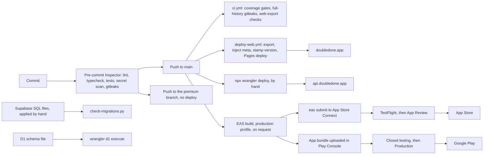

- **Local gate.** The repo is an npm-workspaces monorepo (`client` and `server`). `npm run setup` points git at [`.githooks/`](../.githooks). The pre-commit Inspector runs lint (when JavaScript or TypeScript is staged), the typecheck for both workspaces, the test suites, a regex secret scan of the added lines, and `gitleaks protect --staged` when gitleaks is installed. A `commit-msg` hook reminds (without blocking) that a `feat` or breaking commit should update [`decision-log.md`](../decision-log.md).
- **CI** ([`ci.yml`](../.github/workflows/ci.yml)) runs on pushes and pull requests to `main`: lint, typecheck and `test:coverage` with coverage floors (client logic 90 percent lines, functions and statements, 85 percent branches), a full-history gitleaks scan, and a web export that checks the injected meta and the stamped version file.
- **Web.** Every push to `main` deploys ([`deploy-web.yml`](../.github/workflows/deploy-web.yml)): `expo export -p web`, then `inject-web-meta.mjs`, then `stamp-version.mjs`, then `wrangler pages deploy` to the `doubledone` Pages project. The public `EXPO_PUBLIC_*` values come from repository variables, and the only secret is a Pages-scoped Cloudflare API token. The deploy does not wait for CI, so the local Inspector is the real gate before a push. In-progress paid work lives on a `premium` branch that deploys nothing.
- **Worker.** Deployed by hand with `npx wrangler deploy` from `server/`. Worker secrets are set with `npx wrangler secret put` and never live in the repo. A new route ships to the Worker before any client that calls it, and is checked by expecting a 401 without a token (see the catch-all in section 2.3).
- **Native.** [`client/eas.json`](../client/eas.json) keeps the build numbers on EAS (`appVersionSource: remote`, `autoIncrement` on production), while [`client/app.json`](../client/app.json) holds the marketing version (1.8.0). iOS builds go through `eas submit` to App Store Connect, then TestFlight and App Review. Android app bundles are uploaded in the Play Console, released to closed testing first and then Production. Builds run only when the owner asks, because each one spends the EAS build quota. Store release notes live in [`docs/release-notes/`](release-notes).
- **Data stores.** Supabase migrations are pasted into the SQL editor and verified with [`check-migrations.py`](../scripts/check-migrations.py). The D1 schema is idempotent and applied with `wrangler d1 execute`.
- **Tests.** About 1,900 automated tests across 102 files (vitest, pure logic, the AI request shape asserted on the pure request builders, with no live model calls), plus a 477-case manual end-to-end suite generated from [`scripts/gen-test-suite.py`](../scripts/gen-test-suite.py) into [`docs/qa/`](qa). See [`docs/testing.md`](testing.md).

### The update nudge, through `version.json`

The app asks one static file whether a newer version exists: [`client/public/version.json`](../client/public/version.json), fetched from `https://doubledone.app/version.json` with a 2.5 second timeout ([`update-check.ts`](../client/src/lib/update-check.ts)). It has one field per platform.

- `web` is stamped from `client/app.json` at deploy by [`stamp-version.mjs`](../scripts/stamp-version.mjs), so it is always the version actually serving. The committed file holds a placeholder.
- `ios` and `android` are bumped by hand, and only once a release is live in that store, because the web deploys on push while the stores lag behind review and staged rollout.
- The rules are pure and tested ([`updates.ts`](../client/src/lib/updates.ts)). Settings states the result plainly. Anywhere else the app mentions an update only when the gap is large and it has been at least 14 days since the last mention. A failed or malformed fetch means "we could not tell", never an error on screen. The web route is a reload, and the store builds link to their store page.

The Worker plays no part in the update check. A static file deployed by the same push as the web cannot drift from it.

---

## 6. Security model

| Concern | Control | Code |
|---|---|---|
| Who is asking | Every money route, every Premium AI route, the REST API, every MCP tool call, the OAuth consent step and the disconnect switch verify the Supabase JWT cryptographically: signature against the project's JWKS, algorithms pinned to ES256 and RS256, issuer checked, `sub` required, expiry enforced. Any failure returns null and the caller refuses. Decode-only helpers exist only to read a claim after verification or to time a cache | [`verify.ts`](../server/src/verify.ts) |
| What they may touch | RLS on every Supabase table. Personal rows are `auth.uid() = user_id`. Shared rows are visible to pair members only, and pairing runs through security-definer RPCs with an empty `search_path`, granted to signed-in users only. The REST API and MCP server reach Supabase with the person's own token, so RLS applies to agents exactly as it does to the app | [`supabase/schema.sql`](../supabase/schema.sql), [`supabase/ours.sql`](../supabase/ours.sql), [`api.ts`](../server/src/api.ts), [`mcp.ts`](../server/src/mcp.ts) |
| No elevated key | No Supabase service-role key is used anywhere, in the client or the Worker | [`supabase.ts`](../client/src/lib/supabase.ts) |
| Secrets | Held only as Worker secrets, by name: `ANTHROPIC_API_KEY`, `SUPABASE_URL`, `SUPABASE_ANON_KEY`, `STRIPE_SECRET_KEY`, `STRIPE_WEBHOOK_SECRET`, `RC_WEBHOOK_AUTH`, `RC_WEBHOOK_HMAC`, `RC_SECRET_KEY`, `MCP_GRANT_KEY`, `VAPID_PRIVATE_KEY`, `ANALYTICS_TOKEN`, `COMP_EMAILS` and others. The client carries only public values: the Supabase URL and publishable key, RevenueCat's public SDK keys and the VAPID public key | [`server/src/index.ts`](../server/src/index.ts), [`server/src/revenuecat.ts`](../server/src/revenuecat.ts) |
| Spend and abuse | Per-IP `AI_LIMITER` (30 a minute), with a separate key for `/event`. An allowed-origin check for browser calls (native apps send no Origin). A 100 KB cap on text AI bodies, a 2 MB ceiling on the declared body size of every request, a 1.9 MB cap on Scan images. Keepsakes limited to 20 a day per IP. MCP `break_down` capped at 20 an hour per person, failing closed. `OTP_LIMITER` (5 a minute per IP) on the MCP sign-in page and `BILLING_LIMITER` (5 a minute per person) on deletion and reconcile. The hourly monitor emails the owner when spend reaches half the monthly cap or is projected to pass it | [`wrangler.jsonc`](../server/wrangler.jsonc), [`monitor.ts`](../server/src/monitor.ts) |
| Money | Fail closed throughout: an unreadable entitlement refuses a charge and refuses paid compute. Deletion cancels billing before anything is deleted. Nothing in the Worker ever calls RevenueCat's refunding revoke | [`stripe.ts`](../server/src/stripe.ts), [`premium.ts`](../server/src/premium.ts), [`rc-v1.ts`](../server/src/rc-v1.ts) |
| Webhooks | Stripe: HMAC-SHA256 signature with a 300 second tolerance. RevenueCat: a constant-time shared-secret header, plus an HMAC signature when `RC_WEBHOOK_HMAC` is set. Both are idempotent through `processed_events`. Sandbox deliveries are logged and not applied, apart from a short named allowlist of review and tester accounts | [`stripe.ts`](../server/src/stripe.ts), [`revenuecat.ts`](../server/src/revenuecat.ts) |
| Agents | OAuth 2.1 with S256 PKCE required and no implicit flow. The Supabase refresh token is held AES-GCM encrypted in D1, never in KV or plaintext. A refresh Supabase clearly rejects (401, 403 or 404) revokes the grant, while a network blip never does. The person can cut every connector off at once from Settings | [`oauth.ts`](../server/src/oauth.ts), [`mcp-grants.ts`](../server/src/mcp-grants.ts) |
| Owner surfaces | `/admin/analytics` needs the `ANALYTICS_TOKEN` and shows aggregates only. `/review-code` shows the latest sign-in code for two App Review accounts, fed by inbound mail, and is live only while its Email Routing rule exists | [`analytics.ts`](../server/src/analytics.ts), [`review-otp.ts`](../server/src/review-otp.ts) |
| Transport | HTTPS everywhere, HSTS on the web origin for a year including subdomains | [`client/public/_headers`](../client/public/_headers) |
| The repository | Public from the first push. Secret scanning on every commit and over full history in CI. `.env` files are ignored, and [`.env.example`](../.env.example) documents the client keys | [`SECURITY.md`](../SECURITY.md) |

### Known limits, stated plainly

- **The pasted MCP token is a real Supabase access token.** For about an hour, whoever holds it can call Supabase directly as that person, under RLS. OAuth connectors never see a Supabase token, which is why OAuth is the recommended path.
- **A JWKS outage looks like a bad token.** The verifier returns null for every failure, including a timeout fetching the keys, so a blip shows as a wave of 401s. The OAuth MCP path answers a calm "try again" instead of dropping a live grant. A verifier that tells "rejected" from "unavailable" is parked in the [build plan](../BUILD-PLAN.md) backlog.
- **Free allowances are counted on the device.** The monthly free keepsake and the 15 free energy picks are metered locally. The server's guards on those routes are the per-IP limits, not the allowance.
- **Keepsake images are public by URL.** The keys are random UUIDs and nothing lists them, but anyone given a URL can open it. `POST /scrapbook/purge`, which account deletion uses, takes no token either, so anyone holding a key could also delete that image.
- **The web origin sends no Content Security Policy** today, only HSTS.

---

## 7. Key decisions and trade-offs

Each row names the decision-log entry that records what was decided, what was decided against, and why. Search [`decision-log.md`](../decision-log.md) for the date and title.

| Decision | Why | What it costs | Decision log |
|---|---|---|---|
| Local-first and anonymous-first, with Supabase sync as an opt-in | The app must work the moment it opens, with no account wall, and privacy by architecture beats privacy by promise | Two sources of truth to reconcile, and a merge that has to be right | 2026-06-17, Project founded ("Stack decision"), and 2026-06-18, Cloud sync, part 1 |
| Last write wins by `updatedAt`, with tombstones, unioned completions and client-owned stamps | Simple, testable and offline-friendly for one person's list | Clock skew between writers. Answered with monotonic stamps and a server clock correction | 2026-06-18, Cloud sync, part 2. 2026-07-07, Sync: monotonic updatedAt. 2026-08-09, One clock, and why it corrects rather than replaces |
| One Cloudflare Worker as the only caller of Claude, instead of a Render service | The domain and web host were already on Cloudflare, the key stays a Worker secret, and edge latency suits short calls | Long-running work would need a different home | 2026-06-18, AI backend: Cloudflare Worker, not Render |
| Telemetry in D1, bound to the Worker, pseudonymous by design | The earlier Supabase table could be written by anyone holding the public key. D1 has no public write path | A second database to run. The old Supabase table is still described in `supabase/schema.sql` and no longer written | 2026-06-20, The moat's telemetry store moved to Cloudflare D1 |
| AI proposes and the person accepts, including over MCP | Never adding work someone did not agree to is the product's spine, and guilt mechanics are fatal for this audience | An extra review step on every planning feature | 2026-06-18, F (Strategise) part 2. 2026-07-07, MCP tools expansion |
| Stripe stays the source of truth on the web, RevenueCat is store plumbing only, and every storefront writes one D1 entitlement row | One answer to "is this person premium", whichever store they paid | Cross-store guards and an anonymous-purchase reconcile to maintain | 2026-07-18, Apple IAP shipped. 2026-09-30, Path A slice 1 |
| Android sells only through Google Play, with the Path C "sell nothing" build kept one line away | Play's payments and subscriptions policies. Prices come only from the store's own string | Three compile-time storefront switches, and copy that differs by platform | 2026-09-27, Path C. 2026-10-01, Path A slice 3 |
| Verify the bearer before money, AI spend and both public surfaces | An audit found forged tokens could reach the billing portal and the AI spender while identity was only decoded | A JWKS fetch on cold isolates, and the outage limit above | 2026-09-25, the bearer is verified before money, AI spend, and both public surfaces |
| MCP over OAuth with custody in D1, a stateless consent carry, and a kill switch | Connector interfaces need paste-a-URL sign-in. KV's consistency broke the first design | Custody rows to manage, and a refresh token held server-side (encrypted) | 2026-07-07, MCP OAuth 2.1, and its three hotfixes the same day |
| The update check reads a static `version.json`, not a Worker route | Deployed by the same push as the web, so it cannot go stale | Store versions are still bumped by hand | 2026-08-09, Who calls the sweep, and why the update check does not need a Worker |
| Feature telemetry as daily counters, from a closed allowlist | Enough to see whether a feature is used, without storing a row per event or anything that identifies a person | No per-session or per-person analysis, by design | 2026-10-04, the telemetry review, built |
| Deleting an account stops billing first | A deleted account that keeps charging is the worst outcome | Deletion can be refused when billing cannot be reached | 2026-09-27, deleting an account stops Stripe billing first |
| The web deploys on every push to `main` | `doubledone.app` always matches `main`, with no manual step | The deploy does not wait for CI, so the local Inspector carries the gate | 2026-06-18, Web auto-deploys on every push |

---

## 8. Where to read next

- [`docs/product-spec.md`](product-spec.md): what DoubleDone is and why.
- [`docs/api.md`](api.md) and [`docs/mcp.md`](mcp.md): the two developer surfaces in full.
- [`docs/operations.md`](operations.md): running the Worker, billing runbooks, monitoring.
- [`docs/premium.md`](premium.md): what is free and what is paid, and why.
- [`docs/testing.md`](testing.md): the testing strategy.
- [`SECURITY.md`](../SECURITY.md): how to report a vulnerability.
- [`decision-log.md`](../decision-log.md): the full why-trail.
